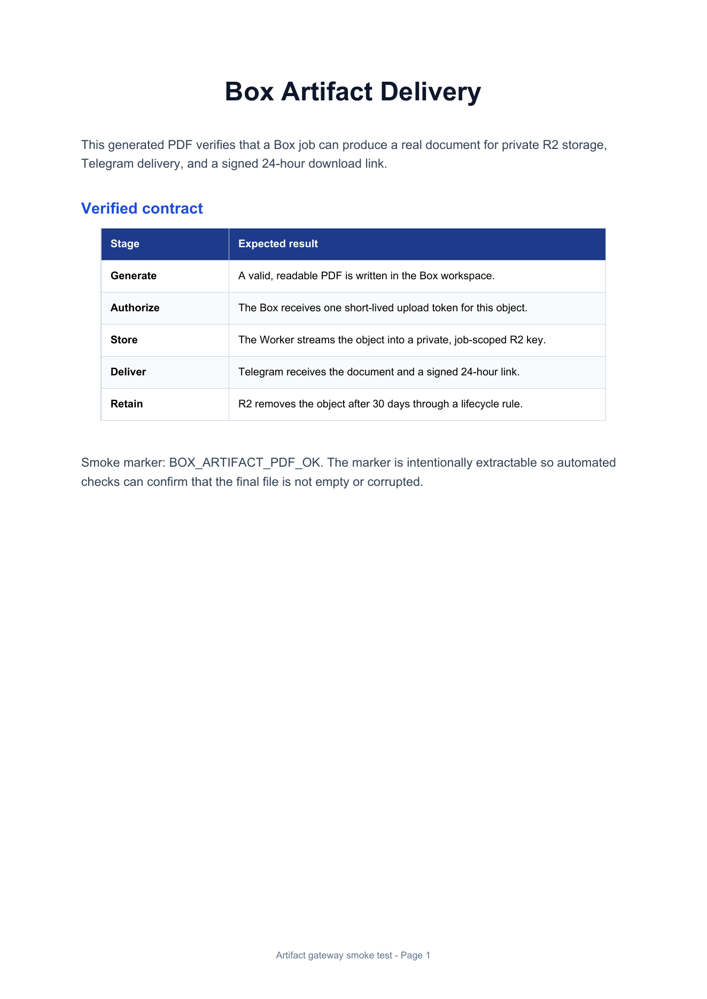
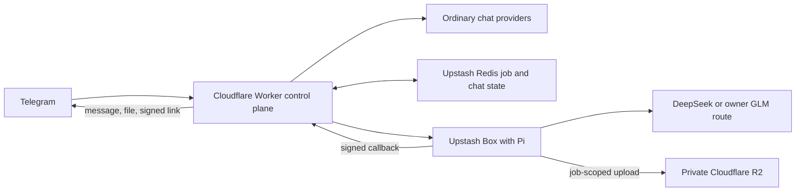

# Telegram Box Agent

Telegram Box Agent is a self-hosted Telegram assistant that keeps short chat
requests on a serverless control plane and moves long-running tool work into an
isolated on-demand sandbox:

- Cloudflare Workers handle chat, authorization, routing, Redis-backed state,
  reminders, digests, callbacks, and private artifact delivery.
- Upstash Box runs long-lived agent work that needs shell commands, files,
  packages, browsers, code execution, or document generation.

The result is an ordinary chat bot that can also acknowledge a job immediately,
work asynchronously, and return a PDF, spreadsheet, archive, image, or other
downloadable artifact without advancing an agent through cron ticks.

> Status: public preview. It is suitable for self-hosted experiments with
> trusted users. Upstash Box is still a preview dependency, and the protected
> shell-action approval classifier is a guardrail rather than a complete
> external-write security boundary. Read [SECURITY.md](SECURITY.md) before
> exposing Box execution to a group.

## Why this exists

Serverless chat handlers are excellent for short requests and poor fits for
stateful work such as researching several sources, running a browser, compiling
LaTeX, or producing a multi-file deliverable. Telegram Box Agent keeps the fast
control path serverless and moves only execution-heavy requests into isolated
on-demand sandboxes.

## Try the control plane locally

The provider-free demo exercises the real deterministic router, Redis record
model, asynchronous job state machine, signed completion callback, delivery
leases, cleanup, and private-artifact link generation using in-memory adapters.
It does not contact Telegram, Cloudflare, Redis, R2, Upstash Box, or a model
provider.

```bash
npm ci
npm run demo
```

Expected flow:

```text
1. Router: Box
2. Accepted immediately: <job-id> (queued)
3. Execution plane attached: running
4. Signed callback applied: succeeded
5. Telegram message: Box job <job-id>: succeeded
6. Private artifact delivery: serverless-sandbox-report.pdf (24-hour signed URL)
```

[Open the sample generated PDF](docs/assets/sample-box-artifact.pdf).





## Highlights

- Deterministic hybrid routing, plus `/agent` and `/quick` overrides
- Immediate asynchronous jobs with status and cancellation
- Owner-managed persistent Box schedules
- Pi-based shell, filesystem, package, browser, and code execution
- DeepSeek as the general Box route and an owner-only GLM coding-plan route
- Private R2 artifacts retained for 30 days with 24-hour signed links
- Direct Telegram delivery for files within Telegram's document limit
- Body-signed QStash schedule callbacks plus nonce-bound, idempotent job callbacks
- Per-user quotas, group concurrency control, cost gates, and response limits
- Telegram approval/resume for recognized protected shell actions
- A provider-free local demo of the complete control-plane lifecycle

## Routing

`/agent <request>` always uses Box. `/quick <request>` always stays on the
ordinary chat path. Otherwise a deterministic pre-router sends requests to Box
when they clearly require file generation, browser automation, code execution,
repository work, or a multi-step deliverable. The normal model does not spend a
turn deciding whether to hand off.

Documents sent with an explicit `/agent` caption are staged into the job. Inputs
downloaded through Telegram are limited to 20 MB; larger inputs must be supplied
through an accessible URL.

## Deploy ordinary chat

Prerequisites:

- Node.js 22+ (required by Wrangler 4)
- A Cloudflare account and Wrangler login
- A Telegram bot token from BotFather
- An Upstash Redis REST database
- At least one configured chat-model provider

```bash
npm ci
cp .dev.vars.example .dev.vars
npm test
npm run typecheck
npm run dev
```

On Windows PowerShell, use:

```powershell
Copy-Item .dev.vars.example .dev.vars
```

Customize the non-secret values in `wrangler.toml`, add deployment secrets with
`npx wrangler secret put <NAME>`, then deploy with `npx wrangler deploy`.
Register the deployed `/webhook` endpoint with Telegram and include the same
`TELEGRAM_WEBHOOK_SECRET` as Telegram's webhook secret token.

The complete setup, including R2 and Box, is in
[docs/deployment.md](docs/deployment.md).

## Enabling the agent runtime

Agent mode additionally requires an Upstash Box API key, a prepared snapshot,
a provider key, a public callback origin, and private R2 buckets.

```bash
npm run r2:create
npm run r2:lifecycle
npm run snapshot:build
npm run snapshot:verify
```

Deploy with `BOX_AGENT_ENABLED=false`, verify callback and artifact endpoints,
then set it to `true`. In a Telegram group, the configured owner runs:

```text
/box enable
/agent Create a short PDF explaining this architecture
```

Box execution is owner-only by default. `BOX_ALLOW_GROUP_MEMBERS=true` is an
explicit trust decision: every member of the bound group can consume provider
budget and cause model-generated code to run.

## Commands

Core agent commands:

- `/agent [--model deepseek|glm] <request>` — force an immediate Box job
- `/quick <request>` — force ordinary chat
- `/agent status [job-id]` — inspect jobs
- `/agent cancel <job-id>` — cancel an authorized job
- `/agent approve <job-id> <nonce>` — owner-only protected-action approval
- `/agent schedule create <5-field UTC cron> [--model deepseek|glm] <request>` — create an owner-only persistent schedule
- `/agent schedule list` — list schedules
- `/agent schedule pause|resume|delete <schedule-id>` — manage schedules
- `/artifact <artifact-id>` — issue a fresh download link
- `/box enable` — owner-only binding of Box to the current numeric group ID

Run `/help` for chat, search, memory, utility, audio, reminder, and digest
commands.

## Documentation

- [Architecture](docs/architecture.md)
- [Box runtime](docs/box-runtime.md)
- [Deployment](docs/deployment.md)
- [Security and threat model](docs/security.md)
- [Operations and costs](docs/operations.md)
- [Demo and launch checklist](docs/demo.md)
- [Project roadmap](PLAN.md)

## Development and verification

```bash
npm test
npm run typecheck
npm run build
npm audit --omit=dev
```

Tests cover routing overrides, group authorization, quotas, concurrency races,
callback forgery and ordering, retries, cancellation, approval resume, schedules,
cost gates, artifact idempotency, and delivery recovery.

`npm run demo` is deterministic integration proof for the local control plane.
The Box snapshot, provider routes, Telegram delivery, R2 lifecycle, and deployed
callback origin still require the credentialed acceptance checks in
[docs/deployment.md](docs/deployment.md); CI does not claim to emulate those
external services.

## Security defaults

- Authorization fails closed. With both `WHITELISTED_USERS` and
  `WHITELISTED_GROUPS` empty the bot denies every request, and the `/webhook`
  endpoint rejects all traffic unless `TELEGRAM_WEBHOOK_SECRET` is configured
  and matches Telegram's secret token.
- `WHITELISTED_GROUPS` authorizes everyone who speaks in a listed group, scoped
  to that group only — it never grants private-chat access. Treat it as a
  statement that every current and future member of that group is trusted.
- `OWNER_USER_ID` is never inferred. It is required for owner-only commands and
  mandatory when `BOX_AGENT_ENABLED=true`.
- Secrets belong in Wrangler secrets or `.dev.vars`, never source control.
- Model-provider authorization is attached by the Box host to the exact provider
  hostname; the secret does not enter the container.
- URL fetching rejects private, loopback, link-local, metadata, and reserved
  addresses, including IPv4 smuggled inside IPv6. This is defence in depth: a
  Worker resolves DNS inside `fetch`, so a public hostname pointing at an
  internal address cannot be caught before the request leaves, and Cloudflare's
  egress policy is the boundary that actually stops it.
- R2 is private. Artifact upload and download authority is short-lived and scoped.
- Permanent third-party integration credentials are not supplied to Box.
- Group-member Box execution is disabled unless explicitly enabled.

See [SECURITY.md](SECURITY.md) and [docs/security.md](docs/security.md) for the
remaining limitations.

## Free-tier-first, not free forever

The design can fit within several providers' free tiers for light personal use,
but model requests are BYOK, free allowances are finite, and prices can change.
The runtime validates configured DeepSeek rates against its worst-case job bound
and fails closed if the configured limits could exceed the $1 model-spend cap.

## License

Licensed under the [MIT License](LICENSE).
