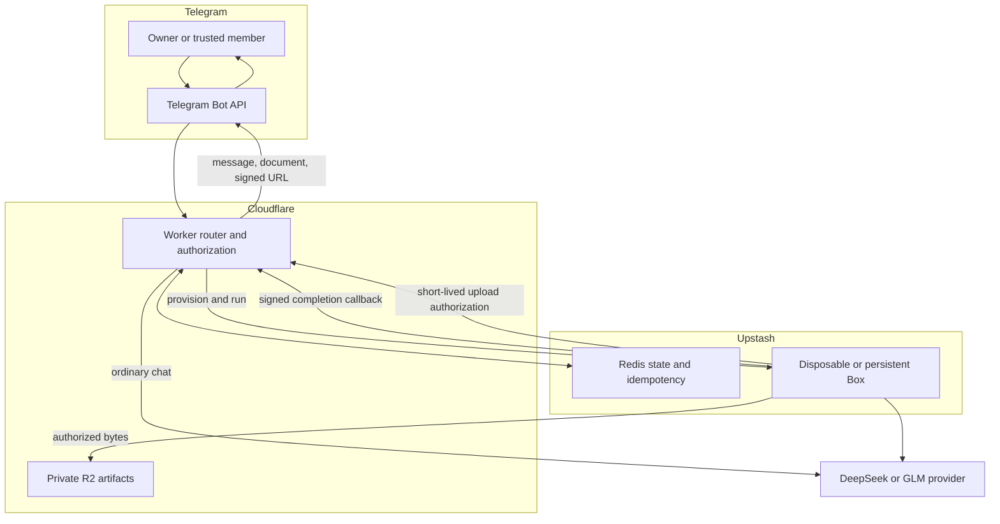
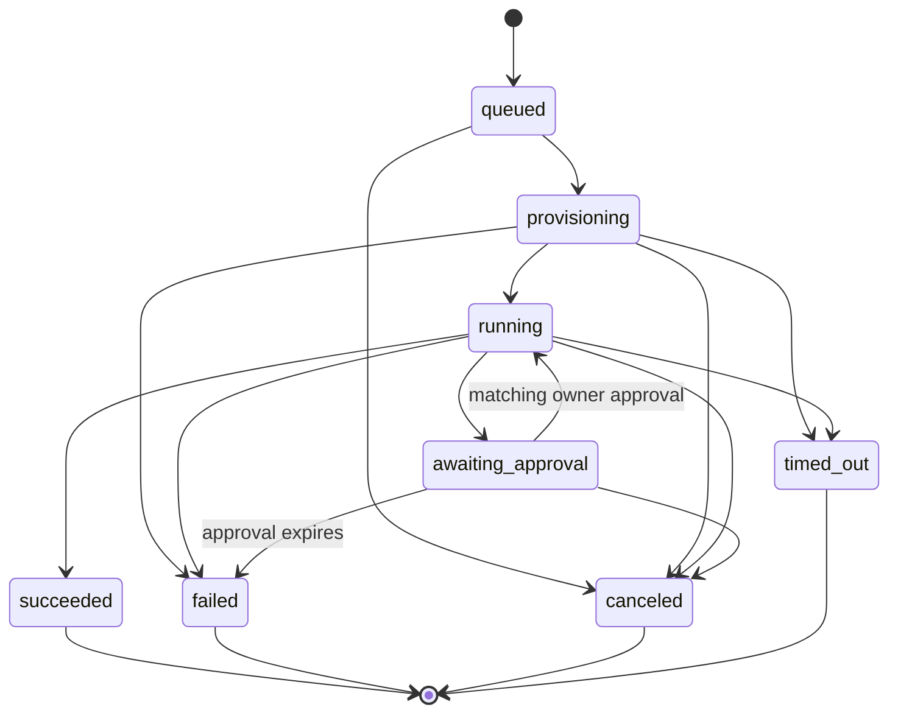

# Architecture

## Design goal

Keep low-latency conversational work on Cloudflare Workers while giving
execution-heavy requests an isolated filesystem, shell, browser, packages, and
longer lifecycle. The Worker is always the control plane; Box is never trusted
as the source of authorization or durable job state.

## Request paths

### Ordinary chat

The Worker authenticates the Telegram update, loads chat state, selects the
configured model role, optionally invokes bounded Worker tools, persists the
result, and replies synchronously. Reminders and digests also remain on the
Worker scheduler.

### Immediate Box job

1. `/agent` or the deterministic router selects Box.
2. The Worker validates the bound numeric chat ID, actor policy, daily quota,
   group concurrency, requested model route, pricing, and runtime configuration.
3. Redis creates a `box_job:v1:*` record before provisioning begins.
4. A fresh Box is restored from the prepared snapshot and receives only
   non-secret configuration, job-scoped artifact authority, and signed callback
   headers.
5. Pi executes the request in the sandbox and emits a completion webhook.
6. The Worker verifies signature, timestamp, job ID, nonce, and ordering before
   applying the state transition.
7. Telegram delivery and Box cleanup use independent Redis leases so either can
   be retried without duplicating the other.

### Recurring Box schedule

Only the configured owner may create or modify schedules. Each schedule owns a
persistent Box and an Upstash-native schedule. The Worker verifies QStash's
short-lived signature over the exact callback URL and body, checks the static
schedule nonce, attests the reported run ID and status against the live Box
schedule, and deduplicates delivery by run ID. Inactive schedules reject new
callbacks. Cloudflare cron does not wake or advance scheduled Box work.

## Deterministic routing

The pre-router is intentionally non-model-based. `/agent` always selects Box and
`/quick` always selects chat. Otherwise `src/agent/box/hybrid_router.ts` recognizes
explicit file deliverables, browser/code/repository execution, and multi-step
operational language. Ambiguous requests stay on the cheaper chat path.

This keeps routing predictable, testable, and token-free. A future model tool
handoff can be added for ambiguous conversational requests, but it is not part
of the current trust boundary.

## Job state machine

Old `agent_run:v1:*` records are terminal/read-only. The cron handler never
selects them for execution.

## Durable records

Redis holds versioned job records, schedule records, callback nonces, approval
state, quota counters, usage/cost data, artifact manifests, idempotency keys,
delivery leases, and cleanup status. R2 holds only artifact bytes under
job-scoped keys. A Redis record remains the authorization source for every
upload, download, status request, cancellation, and callback.

## Trust boundaries

- Telegram updates are untrusted until the webhook secret and actor checks pass.
- Prompts, attachments, fetched pages, generated code, and Box output are
  untrusted.
- Box is an execution environment, not a credential vault.
- Redis and R2 are private control-plane dependencies.
- Completion webhooks do not become trusted merely because they originate from
  an Upstash IP; cryptographic verification and nonce state are required.
- Telegram approval is required for recognized protected commands, but the
  classifier is documented as defense in depth rather than complete mediation.

See [security.md](security.md) for the complete threat model.
